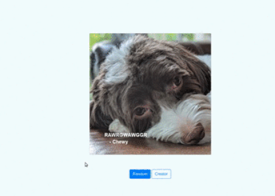

# Motivational Puppy Meme Generator

## Udacity - Intermediate Python Nanodegree



## Introduction
This is a Udacity project which takes in images and captions them with quotes. I will walk you through my implementation as required in the rubric.
> Each module has its README file that describes detailly how it operates. 

### How to run the program
We can run the program in two ways. Before that, we must create a virtual environment.
- Navigate to the root directory and run the command to create a virtual environment `$ python3 -m venv env`
> You can check out this [resource](https://packaging.python.org/guides/installing-using-pip-and-virtual-environments/) on how to install virtualenv if you haven't installed yet.

- Source activate to the virtual environment `$ source env/bin/activate`
- Install all dependencies from the requirements.py file `$ pip install -r requirements.txt`


#### Run from command line

The file `meme.py` contains codes to run the application from the command line. It takes in optional arguments like:
- `--path`: The path to the image file to caption
- `--body`: Quote body to add to the image
- `--author`: Quote author to add to the image

To run the program on the command line with all the options, move to the src directory and run the command:
```
$ python meme.py --path  './_data/photos/dog/xander_1.jpg' --body "Do something today your future self will thank you for" --author "Eyong Kevin"

>> ./tmp/xander_1.jpg

```
The above command returns the path to the captioned image. This captioned image will be stored in the `./temp/` folder


> I am not the author of that quote, I just used my name as the author for demonstration purposes and also because it is my favorite quote

#### Run Flask app
 
Move to the root directory and run the flask app with `$ python app.py`

This will start the server at the address `http://127.0.0.1:5000/`

Use your favorite browser(Chrome for me) to run the address.

Use the button `Random` to automatically generate the meme or use the `Creator` button to fill the form, submit and see your image captioned with your quote.
> The program doesn't work well with `.png` extensions. To get the best results, use `.jpg`


### Project Setup and Code Style

My implementation adheres to the [PEP 8 style](https://www.python.org/dev/peps/pep-0008/) and follows common best practices like:
- Variable, function, methods and class names are clear and self-explanatory. 
- Code is DRY(Don't Repeat Yourself) and methods demonstrate the principle of composition. I use decorators to authenticate data of a function before it is processed. I also define functions in the helper module if these functions are called in multiple areas of the program so that I don't repeat myself
- Each class, method, and function has a docstring that describes what it does and what arguments it expects and returns.
- A virtual environment is set up to manage all dependencies used in this project. All dependencies are listed in a `requirements.txt` file which was created using the `$ pip freeze > requirements.txt` command.
- Classes are organized into multiple directories, with related classes being placed together in a module which includes proper `__init__.py` file.

#### Exception handling
A module was created which contain
Custom extension classes to handle possible exception cases that may occur while running the project. Get more details here

## Project Modules
The project has 4 modules:
- [helper_func](https://github.com/Eyongkevin/PYND/tree/master/02_meme_gen_starter/src/helper_func): contain helper functions
- [quote_engine](https://github.com/Eyongkevin/PYND/tree/master/02_meme_gen_starter/src/quote_engine): Contain classes to extract a file's content and prepare them for captioning.
- [meme_generator](https://github.com/Eyongkevin/PYND/tree/master/02_meme_gen_starter/src/meme_generator): Contain files for image captioning.
- [app_exceptions](https://github.com/Eyongkevin/PYND/tree/master/02_meme_gen_starter/src/app_exceptions): contain files for exception handling. 

 and each module contains a readme file that describes in detail its functionality. Click on each link above to view their readme.

## Package your Application
Application is packaged such that it can be run on the command line and as a flask app. This is described above (How to run the program)

For the command-line version, we can either pass in arguments for a path to the image, body, and author of the quote, which the program will generate a captioned image and store it in the `./temp` director. 

For the flask app version, we have two buttons:
- **Random**: This will randomly select from stored images and files containing the quote(body and author) and generate the captioned image which it stores it in the `./static` folder. 
- **Creator**: This will present a form that will be required to fill it with the URL of the image, a body, and author of the quote. Then, the app will extract the image using flask request, then generator a captioned image with the quote body and author, and store it in the `./static` folder

## Important Note
- Image size should be at least `500x666`
- Quote's body shouldn't be too long. Even though I implemented a function to wrap the body of the quote, it could still overflow if too long.
- Clear browser cache each time before running the flask server. When I run it at my end, I experience some cache issues where the app keeps returning the same result for different entries.


